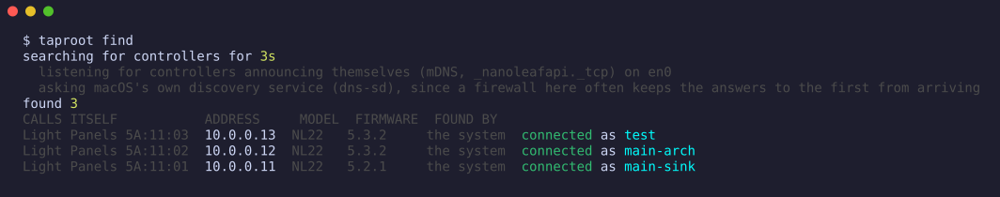
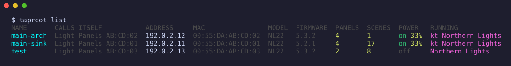
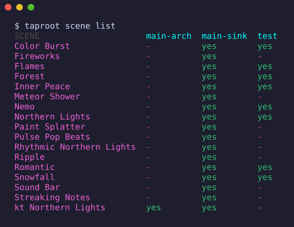
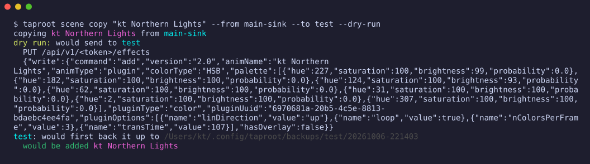
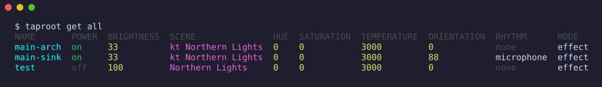
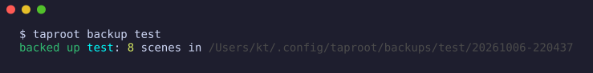
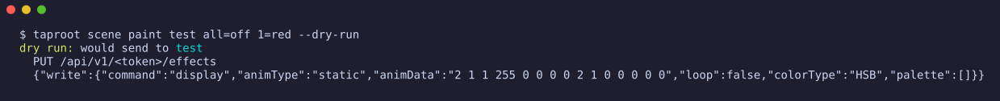
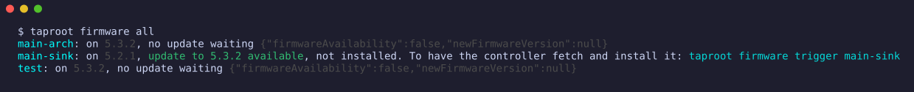
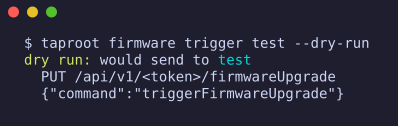

# 🌱 taproot — Nanoleaf Aurora Light Panels, without the app

[](https://github.com/katbyte/nanoleaf-aurora-taproot/releases/latest)
[](https://github.com/katbyte/nanoleaf-aurora-taproot/blob/main/go.mod)
[](https://github.com/katbyte/nanoleaf-aurora-taproot/blob/main/LICENSE)


A command-line utility, Go SDK, and a web page, for the original Nanoleaf Aurora Light Panels (model NL22). It
talks straight to the controllers on your own network: no app, no account, no cloud.

It exists because the official app stopped applying scenes to these controllers and their support was unable to
help after over a year of back and forth. The company seems to have abandoned them.

With taproot you can back up every scene a controller holds, copy a scene from the controller that still has it to
the ones that lost it, and start it. It also does what the app did and the documentation never said: it asks a
controller whether a **firmware update** is waiting and has the controller fetch and install it from Nanoleaf's
cloud, paints each panel a colour, and sets the button lock, the fade between scenes and power-loss recovery.

Nothing on a controller is replaced unless you say so, a controller is backed up before anything is written to it,
and `--dry-run` prints exactly what would be sent without sending it.

## In action

Finding the controllers on the network, and what each is doing:




Every scene on every controller side by side, and copying the one that only one controller still has (`--dry-run`
shows exactly what would be sent, and sends nothing):




Settings, backups, painting panels, and firmware:







The addresses in these are made up; everything else is as it was printed.

## Installation

Download a binary for your platform from the [latest release](https://github.com/katbyte/nanoleaf-aurora-taproot/releases/latest)
(signed with cosign, with build provenance), or:

```bash
go install github.com/katbyte/nanoleaf-aurora-taproot/cmd/taproot@latest
docker pull ghcr.io/katbyte/nanoleaf-aurora-taproot:latest   # the page, see Docker below
```

## Usage

```bash
taproot find                          # the controllers on the network, and which you are connected to
taproot connect 10.0.5.183            # then hold its power button 5 to 7 seconds, until the light flashes
taproot connect 10.0.5.182 --name bedroom
taproot list                          # every controller you are connected to, and what it is doing

taproot scene list                    # every scene on every controller, side by side
taproot scene copy "Northern Lights" --from office --to-all
taproot scene select bedroom "Northern Lights"

taproot backup                        # every controller, each to a dated folder
taproot restore bedroom ~/.config/taproot/backups/office/20261006-123629

taproot firmware all                  # which controllers have a firmware update waiting; asks, changes nothing
taproot firmware trigger bedroom      # has that controller fetch and install it from Nanoleaf's cloud
taproot scene paint office all=off 7=red
```

`find` looks in up to three ways and says which found each controller. It listens for controllers announcing
themselves (mDNS, the service `_nanoleafapi._tcp`). On a Mac it also asks macOS's own discovery service, because
the firewall there often drops the answers to the first. And with `--scan` it knocks on port 16021 at every
address of a subnet, for networks that announcements do not cross.

A scene that a controller already holds can be named in any capitals: `"kt northern lights"` finds
`kt Northern Lights`. Should a controller hold two that differ only in their capitals, type the one you mean exactly.

A controller is named on the command line by the name you gave it, the name it gives itself, its address, or any
part of those that only one controller has: `office`, `53a63c` and `183` can all be the same one.

| command | what it does |
|---|---|
| `find` | searches the network, saying how as it goes; `--scan 10.0.5.0/24` also knocks on every address of a subnet |
| `connect [address\|name]` | gets a token and saves it; keeps asking until the button has been held (`--wait`, default 5m) |
| `connect all` | asks every controller not connected yet, all at once: the one whose button you hold connects, and you name it there and then |
| `list` | the controllers taproot holds a token for: its name for each and the name the controller gives itself, address, MAC, model, firmware, power, what is running |
| `info <controller>` | one controller in full |
| `rename <controller> <name>` | changes what taproot calls a controller: `taproot rename 183 office` |
| `get <controller\|all> [setting]` | what a controller is set to: every setting, or the one named, printed alone for a script |
| `set <controller\|all> <setting> <value>` | changes a setting: `power`, `brightness`, `scene`, `hue`, `saturation`, `temperature`, `orientation`, `rhythm`; `--by -10` moves a number; also `buttons`, `fade` and `recovery`, which the app sets and a controller does not say back |
| `forget <controller>` | has the controller delete the token, and removes it; `--local` leaves the controller alone |
| `firmware <controller\|all>` | what a controller says about a firmware update, as the app asks it |
| `firmware trigger <controller\|all>` | has the controller fetch and install its firmware from Nanoleaf's cloud, as the app's update button does |
| `scene list [controller]` | a controller's scenes, or with none named, which controller holds which |
| `scene dump <controller> [scene]` | a scene as JSON, exactly as the controller holds it; all of them when none is named; `--out file` |
| `scene push <controller> <file>` | adds the scene, or scenes, in a file a dump wrote |
| `scene copy <scene> --from A --to B` | copies a scene between controllers; `--to-all` for every other one |
| `scene select <controller> <scene>` | starts a scene |
| `scene rename <controller> <scene> <name>` | gives a scene another name, where it is |
| `scene paint <controller> <panel=colour...>` | holds each panel at a colour, shown but not saved: `all=off 7=red`; `--save <name>` keeps it as a static scene |
| `scene delete <controller> <scene...>` | takes scenes off a controller; `--except <scene>` deletes every one but those; needs `--force` |
| `backup [controller] [dir]` | every scene to a folder, one file each, with checksums |
| `restore <controller> <dir>` | adds a backup's scenes to a controller, any controller |
| `serve [port]` | the web page |

`push`, `copy` and `restore` take `--force`, `--as <name>` to store a scene under another name, and `--select` to
start it once it is there. Every command takes `--json` for scripts and `--dry-run`.

### Getting a token

A controller hands out a token only to somebody who can reach it: hold its power button for 5 to 7 seconds, until
the light flashes, and for about 30 seconds it will give one to whoever asks. `taproot connect` asks every two
seconds until that happens, so start it first and then go to the button.

When controllers look alike on the network and all you know is which one you are standing at, `taproot connect all`
asks every one that is not connected yet. Hold the button on the one you want: taproot says which answered and asks
what to call it, then goes on asking the rest until they are all connected or you type `q` and enter, or press ctrl-c.

A token never expires and gives full control of the controller. taproot keeps them in
`~/.config/taproot/controllers.json`, which only you can read, and never prints one, not in output, logs, errors
or a dry run. `--token-file` takes a token you already have instead of asking for a new one.

### What writing does

A scene is sent to a controller exactly as it was read from one. taproot never builds a scene, because what a
scene is made of differs between firmware versions and only a controller knows what it will take back.

A controller replaces a scene of the same name without a word and has no undo, so before sending anything taproot
looks at what the controller holds:

| the controller has | what happens |
|---|---|
| no scene of that name | it is added |
| the same scene | nothing: it is left alone |
| a different scene of that name | refused, saying which parts differ; `--force` replaces it |
| not the plugin the scene runs | refused: the controller could not play it |

Before the first write of a run the whole controller is backed up, to a dated folder under
`~/.config/taproot/backups`. After each write the scene is read back and compared with what was sent, and any
difference is reported. A backup is never written over, and its files are read-only.

Deleting is as careful. `scene delete` deletes nothing without `--force`, never deletes the scene that is running,
and backs the controller up first, so `taproot restore` can put back whatever went. `scene rename` loses nothing, so
it needs no `--force`, but it backs up first all the same, refuses a name another scene already has, and leaves the
scene that is running alone.

Controllers on different firmware hold the same scene slightly differently: firmware 5.3.2 adds a field of its own
(`rhythmFeatureSource`) to every scene it stores. taproot knows that field is the controller's and not the scene's,
so a scene copied from older firmware is still found to be there, and unchanged, the next time.

### Settings

```bash
taproot get office                     # every setting, and what each can be set to
taproot get office brightness          # 33
taproot set office brightness 40
taproot set office brightness --by -10 # dimmer by ten
taproot set office brightness 0 --fade 30s
taproot set all power off              # every controller
```

`hue`, `saturation` and `temperature` turn every panel one colour or one white in place of the scene; setting
`scene` goes back. `set` reads the setting before and after, so what it reports is what the controller says.

## The page

```bash
taproot serve                 # http://localhost:7668/, and on every address this machine has
taproot serve 127.0.0.1:7668  # this machine only
taproot serve --dry-run       # look around: every change is printed here instead of sent
```

One page over every controller taproot is connected to. Each is drawn with its panels where they really sit and
lit the way its scene moves, with:

- power and brightness
- its scenes, with their colours; click one to start it
- **copy…** beside each scene, to send it to other controllers, with the same rules as the command
- **back up** and **flash**, which blinks the panels to show which controller is which
- **connect a controller**: search the network or type an address, then hold the power button

A change made anywhere else, at the controller's own button say, shows up as it happens.

The controller reports where each panel is and which scene is running, but not what colour each panel is at this
instant. So the motion on the page is worked out from the scene: a likeness of the six built-in motions, not a
recording. If the picture is turned differently from your wall, the two small buttons that appear over it turn
and mirror it.

The page has no login, and anyone who can reach its port can use it, so put one in front of it (oauth2-proxy,
Cloudflare Access) before exposing it beyond the local network. Two things it does by itself: it answers only to
names it expects (this machine's, `localhost`, an IP address, `anything.local`; `--allow-host` adds the name a
proxy is reached by), and it refuses a request that changes anything unless it came from the page itself. Tokens
never reach the browser.

## Docker

A container that serves the page, for a machine that is always on.

```bash
docker compose pull    # ghcr.io/katbyte/nanoleaf-aurora-taproot, published on each release; `make docker` builds it from a checkout
docker compose up -d   # -> http://localhost:7668/ ; the tokens and the backups live in ./data
```

Connect controllers from the page: **connect a controller**, type an address, hold the button. To bring over
controllers taproot is already connected to on another machine, copy its `controllers.json` into `./data` before
the first start.

Connecting by address always works. Searching does not from Docker's own network, which cannot hear controllers
announcing themselves; on Linux `network_mode: host` in `docker-compose.yml` fixes that, and knocking on a subnet
works either way.

## Configuration

All options can be passed as command-line flags, environment variables, or via a `.taproot` file (env format)
in your home directory or the current one.

| Variable | Flag | Description |
|---|---|---|
| `TAPROOT_CONFIG_DIR` | `--config-dir` | Where `controllers.json` and the backups live (default `~/.config/taproot`) |
| `TAPROOT_BACKUP_DIR` | `--backup-dir` | Where backups go (default `backups` inside the config dir) |
| `TAPROOT_TIMEOUT` | `--timeout` | How long one request to a controller may take (default `30s`) |
| `TAPROOT_ALLOW_HOSTS` | `--allow-host` | With `serve`: names the page may be reached by, besides this machine's own; `*` for any |
| `TAPROOT_OUTPUT_QUIET` | `--quiet` | Minimal output |
| `TAPROOT_OUTPUT_SILENT` | `--silent` | No output |
| `TAPROOT_LOG` | | `debug` or `trace` for HTTP dumps, with the token taken out |

## The SDK

`sdk/aurora` is a Go client for the controller's API, standard library only, and knows nothing of taproot. It
covers everything Nanoleaf documents for Light Panels, 27 endpoints and 8 effect commands, which `make apicheck`
checks against the saved documentation.

```go
c, err := aurora.New("10.0.5.183", token)

info, err := c.Info(ctx)                        // model, firmware, state, layout, scene names
scene, err := c.Effect(ctx, "Northern Lights")  // the scene, exactly as the controller holds it
err = other.AddEffect(ctx, scene)               // and onto another controller, as it was read
err = c.SetBrightness(ctx, 40, 2*time.Second)

err = c.Events(ctx, nil, func(e aurora.Event) { /* a change, as it happens */ })
```

`aurora.WithDryRun` makes a client that sends every read and none of the writes, handing each write it would
have made to a function instead. `sdk/aurora/auroratest` is a canned controller for tests, which answers as a
real NL22 did.

Nanoleaf publishes no machine-readable description of the API, so the client is written by hand against its
documentation, saved in [`sdk/aurora-api-specs`](sdk/aurora-api-specs/README.md) along with what a real controller
does differently.

## Development

```bash
make tools       # pinned dev tools into .tools/bin
make             # fmt + build -> ./taproot
make check-all   # build, test, lint, actionlint, yamllint, shellcheck, typos, depscheck, apicheck
```

No test needs a controller. The unit tests run against a canned one built from what a real one answered. The
acceptance tests run the built binary against recordings of a real one, made through a proxy that sits between
the two:

```bash
make test                                          # against the recordings, as CI does
TAPROOT_TEST_LIVE=office make testacc              # against a real controller, which is only ever read
TAPROOT_TEST_LIVE=office make record               # the same, writing down what it answers
TAPROOT_TEST_LIVE=office make record-check         # the recordings against the controller: what has firmware changed?
TAPROOT_TEST_LIVE=office TAPROOT_TEST_SPARE=hall make record   # also the tests that write, to a controller that may be written to
```

The binary under test is never given a real token: the proxy swaps it in, so a recording cannot hold one. The
controller named by `TAPROOT_TEST_LIVE` is behind a proxy that refuses anything but a read. The tests that write
add scenes named `taproot test ...` to the spare and take them off again.

What comes next is in [docs/ROADMAP.md](docs/ROADMAP.md).
